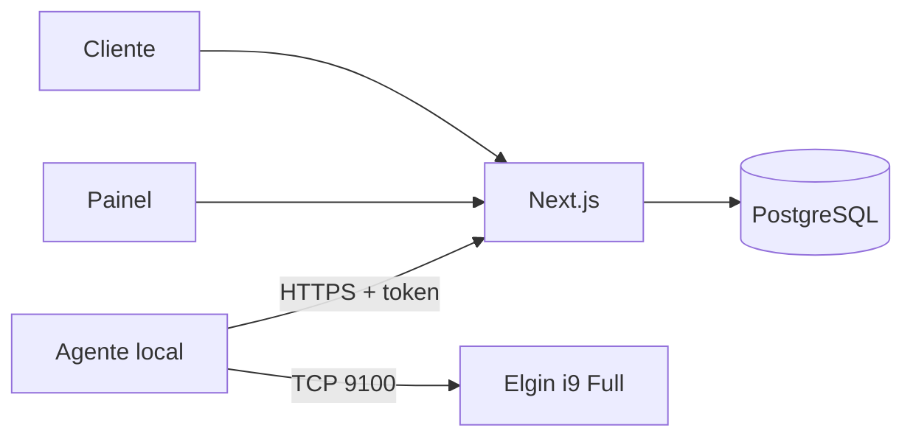

# Moca Delivery

Cardápio digital full stack para restaurante japonês, com carrinho, checkout, cálculo de entrega por distância, painel operacional e impressão automática de comandas em impressora térmica Elgin.

**Desenvolvido por Ian Antonio.**

> Projeto de portfólio preparado para demonstração técnica. As fotografias dos produtos usam um espaço reservado e podem ser adicionadas sem alterar a estrutura do catálogo.

## Contexto do projeto

O Moca Delivery foi desenvolvido durante um trabalho **freelance de 1 mês**, com foco em transformar o atendimento de um restaurante japonês em um fluxo digital completo: cardápio, carrinho, checkout, registro e gestão dos pedidos e preparação da impressão das comandas.

Nesse período, atuei no levantamento do fluxo do negócio, prototipação da experiência, desenvolvimento full stack, modelagem do banco de dados, segurança das APIs, testes e documentação para implantação. O resultado é uma solução pronta para portfólio e demonstração técnica, com as integrações que dependem de fornecedores externos mantidas isoladas até a homologação.


## Destaques

- Catálogo responsivo com busca, categorias, variações, combos, bebidas, vinhos e drinks.
- Carrinho persistente com quantidades e observações por item.
- Localização automática do cliente e entrega calculada a **R$ 1,00 por quilômetro**, validada novamente no servidor.
- Checkout para entrega ou retirada com Pix, crédito, débito ou dinheiro.
- Preços recalculados no servidor para impedir manipulação pelo navegador.
- Idempotência, limite de pedidos e validação de CPF/CNPJ.
- Registro de pedidos em PostgreSQL/Neon.
- Painel protegido em `/admin`, atualização de status e reimpressão.
- Fila segura de impressão com token, lock, tentativas e histórico de eventos.
- Agente local para Windows e cupom ESC/POS não fiscal na Elgin i9 Full.
- Confirmação do pedido por WhatsApp e aviso de privacidade.
- Health check, TypeScript, ESLint e testes automatizados.

## Arquitetura



A impressora nunca é exposta à internet. O agente instalado no computador do restaurante consulta a fila por HTTPS e envia a comanda pela rede local.

## Tecnologias

- Next.js 16, React 19 e TypeScript
- PostgreSQL/Neon
- API Routes e validação no servidor
- Node.js no agente de impressão
- ESC/POS via TCP
- GitHub Actions para build, lint e testes

## Começando

Requisitos: Node.js 20.9 ou superior e um banco PostgreSQL.

```bash
npm install
cp .env.example .env.local
npm run dev
```

Abra `http://localhost:3000`. Para usar a API de pedidos, preencha `DATABASE_URL` em `.env.local` e execute o SQL de `database/schema.sql`.

## Variáveis de ambiente

| Variável | Uso |
| --- | --- |
| `NEXT_PUBLIC_SITE_URL` | URL pública do cardápio |
| `NEXT_PUBLIC_WHATSAPP_NUMBER` | WhatsApp com DDI e DDD, somente números |
| `ROUTING_API_URL` | Serviço de rotas; por padrão usa a instância pública do OSRM |
| `DATABASE_URL` | Conexão PostgreSQL/Neon |
| `PRINT_AGENT_TOKEN` | Segredo de no mínimo 32 caracteres para a fila de impressão |
| `ADMIN_TOKEN` | Segredo de no mínimo 32 caracteres para o painel operacional |
| `RAFFINATO_MODE` | Deve permanecer `disabled` sem homologação do fornecedor |

Gere tokens independentes e longos. Nunca publique `.env.local` ou credenciais no GitHub.

## Comandos

```bash
npm run dev           # desenvolvimento
npm run build         # build de produção
npm run lint          # análise estática
npm test              # todos os testes automatizados
npm run test:printer  # cupom de teste no modo configurado
```

## Impressão na Elgin

O diretório `print-agent/` contém o serviço local. No computador do restaurante:

```bash
cd print-agent
copy .env.example .env
npm start
```

Configure a URL publicada, o mesmo `PRINT_AGENT_TOKEN` e o IP da impressora. Para a Elgin identificada no ambiente de teste:

```env
PRINTER_MODE=network
PRINTER_HOST=192.168.15.99
PRINTER_PORT=9100
```

Veja [a instalação completa](docs/INSTALACAO-PEDIDOS-E-IMPRESSAO.md) antes do primeiro teste físico.

## Publicação

- **GitHub Pages:** publica automaticamente a demonstração segura da pasta `dist/`.
- **Vercel:** executa a aplicação completa com banco, APIs, painel e fila de impressão.
- **Domínio próprio:** remove o nome da plataforma da URL compartilhada.

Veja o [passo a passo de publicação](docs/PUBLICACAO.md).

## Limites operacionais

- A comanda impressa é **não fiscal**.
- Raffinato e NFC-e não estão integrados. O adaptador permanece desativado até o fornecedor disponibilizar API, credenciais e homologação.
- O teste físico final depende da impressora ligada, com papel, IP correto e porta TCP 9100 acessível.
- Preços, disponibilidade, dados do restaurante e localização de origem devem ser confirmados antes do uso comercial.

## Documentação

- [Instalação de pedidos e impressão](docs/INSTALACAO-PEDIDOS-E-IMPRESSAO.md)
- [Integração Raffinato](docs/INTEGRACAO-RAFFINATO.md)
- [Apresentação para LinkedIn](docs/LINKEDIN.md)
- [Configuração do repositório no GitHub](docs/GITHUB.md)
- [Publicação no GitHub e na Vercel](docs/PUBLICACAO.md)
- [Política de segurança](SECURITY.md)

## Licença

Distribuído sob a licença MIT. Consulte [LICENSE](LICENSE).

---

Desenvolvido por **Ian Antonio** · 2026
